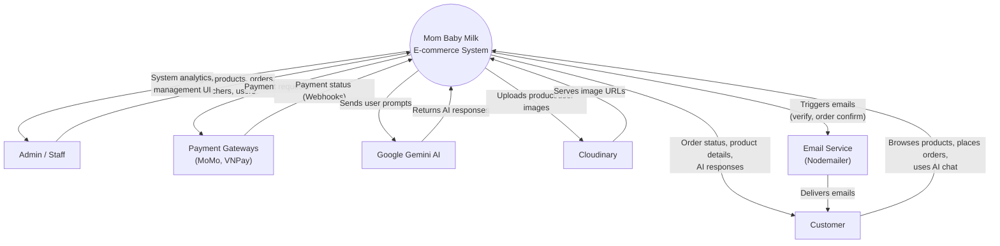
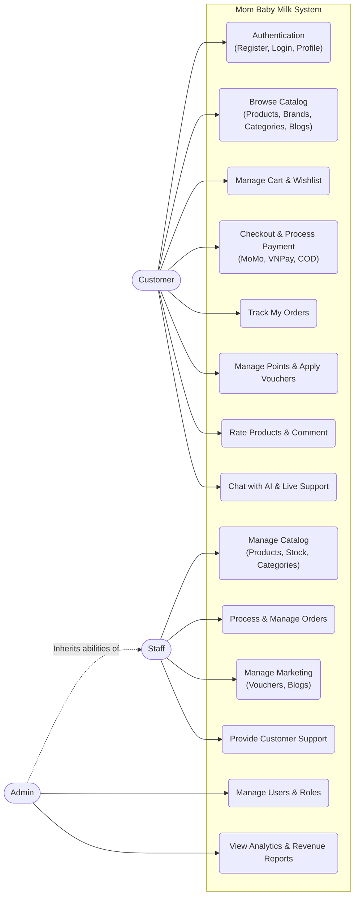
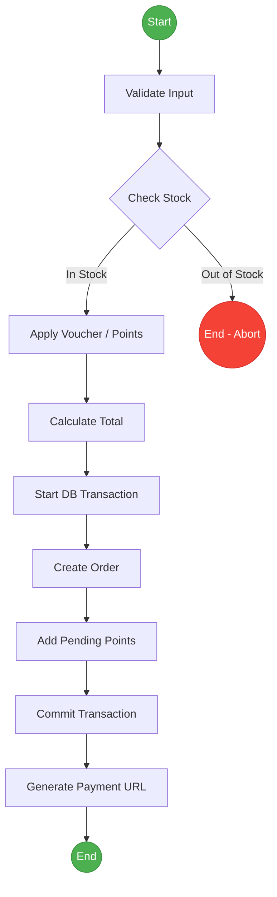
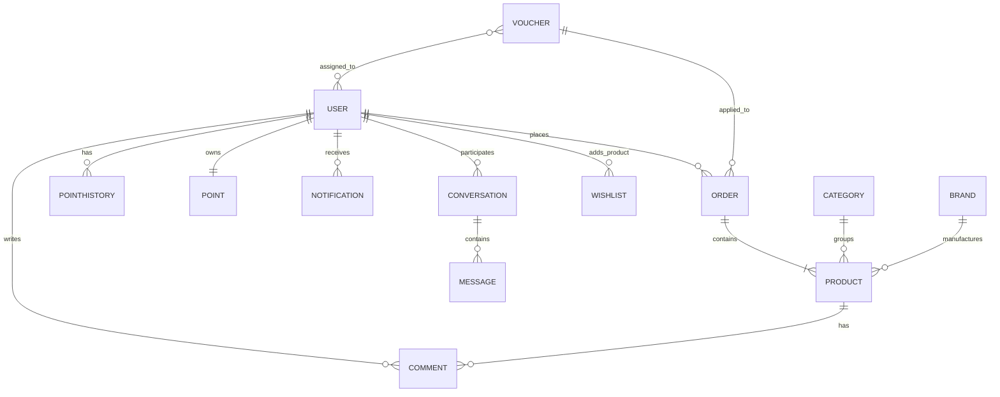
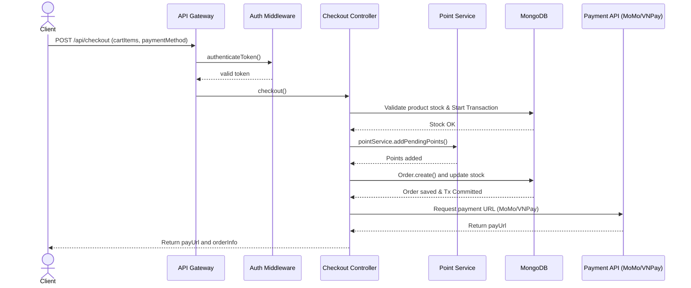
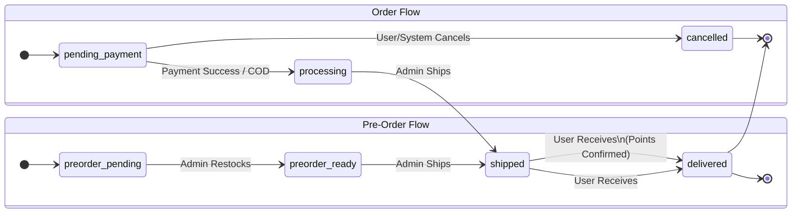
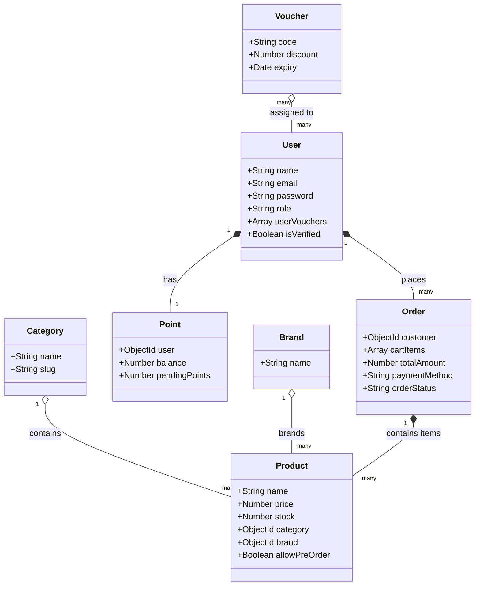

  # Course Project Report

## I. Overview

### I.1 Project Information
* **Project name:** Mom Baby Milk E-commerce System
* **Project code:** MBM
* **Group name:** SWD392-G1
* **Software type:** Web Application

### I.2 Project Team
| Full Name | Role | Email | Mobile |
| :--- | :--- | :--- | :--- |
| Nguyen Trung Kien | Lecturer | kiennt@fe.edu.vn | 0912656836 |
| Nghiem Thi Thuy Van | Leader | | |
| Dam Thi Huyen | Member | | |
| Dao Thi Phuong | Member | | |
| Vu Thi Thuy | Member | | |

---

## II. Requirement Specification

### II.1 Problem description
The Mom Baby Milk system is a comprehensive e-commerce platform designed to replace traditional, disjointed shopping experiences for maternal and baby products. The system provides an integrated solution for browsing, purchasing premium milk and baby care products, and managing loyalty points. Furthermore, it addresses the issue of out-of-stock items by introducing a Pre-Order System and enhances customer support through a Gemini AI-powered Chatbot.

### II.2 Major Features 
* **FE-01:** Browse, search, and filter premium milk, baby food, and accessories by category and brand.
* **FE-02:** Manage shopping cart and perform secure checkout with integrated payment gateways (MoMo, VNPay) or Cash on Delivery (COD).
* **FE-03:** Pre-Order System allowing customers to order out-of-stock products with expected restock tracking.
* **FE-04:** Point & Loyalty System enabling users to earn points on purchases and redeem them for discounts.
* **FE-05:** AI Chatbot integration (Google Gemini) for automated, 24/7 product consultation.
* **FE-06:** Role-based access control and user management (Admin, Staff, Customer) using JWT authentication.
* **FE-07:** Comprehensive Admin Dashboard for managing products, categories, orders, vouchers, and viewing analytics.

### II.3 Context Diagram
Dưới đây là sơ đồ Context Diagram thể hiện hệ thống ở mức cao nhất:



* **Mom Baby Milk System (Center Box)**
* **Terminators / External Entities:**
  * **Customer:** Browses products, manages cart, places orders, chats with AI.
  * **Admin/Staff:** Manages catalog, orders, vouchers, and user accounts.
  * **Payment Gateways (MoMo, VNPay):** Processes secure online transactions.
  * **Google Gemini AI:** Provides intelligent responses for the chatbot.
  * **Cloudinary:** Hosts and serves product images and user avatars.
  * **Email Service (Nodemailer):** Sends order confirmations and verification emails.

### II.4 Nonfunctional requirements 

| # | Feature | System Function | Description |
| :--- | :--- | :--- | :--- |
| 1 | Security | JWT Authentication | Passwords must be hashed using bcrypt. API requests must be secured with JSON Web Tokens (Access & Refresh tokens). |
| 2 | Performance | Connection Pooling | Database connections must be cached to minimize latency across API requests. |
| 3 | Reliability | ACID Transactions | Checkout and stock deduction processes must use MongoDB transactions to prevent race conditions and overselling. |
| 4 | Integration | Webhook Handling | Payment webhooks must enforce signature verification and idempotency to avoid duplicate order processing. |

### II.5 Functional requirements

#### II.5.1 Actors

| # | Actor | Description |
| :--- | :--- | :--- |
| 1 | Customer | Registered users who can browse products, place orders, pre-order out-of-stock items, use vouchers, and earn points. |
| 2 | Staff | Employees who process orders, manage product stock, and update shipping statuses. |
| 3 | Admin | System administrators who have full control over analytics, user management, and system configuration. |
| 4 | External System | Payment gateways (MoMo, VNPay), Gemini AI, and Cloudinary. |

#### II.5.2 Use Cases

##### II.5.2.1 Diagram(s)
Dưới đây là sơ đồ Use Case (Use Case Diagram) tổng thể, bao quát toàn bộ các tính năng của Customer, Staff, và Admin dựa trên hệ thống API Backend:



##### II.5.2.2 Use case descriptions

| ID | Use Case | Actors | Use Case Description |
| :--- | :--- | :--- | :--- |
| UC-01 | Checkout Order | Customer | Allows a customer to proceed to checkout, select a shipping address, choose a payment method (MoMo, VNPay, COD), and finalize the order. |
| UC-02 | Authentication | Customer | Allows a customer to register a new account, log in, and manage their profile. |
| UC-03 | Browse Catalog | Customer | Allows a customer to view products, brands, categories, and blogs, including search and filter. |
| UC-04 | Manage Cart & Wishlist | Customer | Allows a customer to add or remove products from their cart and wishlist, and update quantities. |
| UC-05 | Track Orders | Customer | Allows a customer to view their order history and track the status of current orders. |
| UC-06 | Loyalty & Vouchers | Customer | Allows a customer to view loyalty points, earn points on purchases, and apply discount vouchers. |
| UC-07 | Rate Products | Customer | Allows a customer to leave reviews, rate products they have purchased, and write comments. |
| UC-08 | AI Chat & Support | Customer | Allows a customer to interact with the Gemini AI chatbot for product consultation or chat with support. |
| UC-09 | Manage Catalog | Staff, Admin | Allows staff and admin to add, edit, or remove products/categories, and update stock levels. |
| UC-10 | Manage Orders | Staff, Admin | Allows staff and admin to view customer orders, update order statuses, and handle order issues. |
| UC-11 | Manage Marketing | Staff, Admin | Allows staff and admin to create and manage discount vouchers, and publish blog posts. |
| UC-12 | Customer Support | Staff, Admin | Allows staff to respond to customer inquiries and resolve issues via live chat or support system. |
| UC-13 | Manage Users & Roles | Admin | Allows the admin to view all users, assign roles (Staff, Admin), and ban or unban accounts. |
| UC-14 | View Analytics | Admin | Allows the admin to view the system dashboard, sales revenue, traffic analytics, and generate reports. |

**Functional Description Template: UC-01 Checkout Order**
* **UC ID and Name:** UC-01 Checkout Order
* **Created By:** SWD392-G1
* **Primary Actor:** Customer
* **Secondary Actors:** Payment Gateway
* **Trigger:** User clicks "Place Order" in the shopping cart.
* **Description:** User selects shipping address, applies optional vouchers/points, chooses a payment method, and confirms the order.
* **Preconditions:** PRE-1: User is logged in. PRE-2: Cart is not empty.
* **Postconditions:** POST-1: Order is created with status 'pending_payment' or 'processing'. POST-2: Product stock is deducted. POST-3: Points are added to pending balance.
* **Normal Flow:** 
  1.0 User initiates checkout.
  2.0 System validates cart items and checks product stock using an atomic update.
  3.0 User applies a discount voucher (optional).
  4.0 User chooses a payment method (e.g., VNPay).
  5.0 System creates the Order record and starts a MongoDB transaction.
  6.0 System generates a payment URL and returns it to the user.
* **Alternative Flows:** 1.0.1 Payment by COD: System skips payment URL generation and sets order status to 'processing'.
* **Exceptions:** 2.0.E1: Product out of stock: System aborts transaction and prompts user to modify cart or use Pre-Order.
* **Priority:** High
* **Business Rules:** BR1 (Atomic Stock Update), BR2 (Transaction Management)

#### b. Business Rules
| ID | Business Rule | Business Rule Description |
| :--- | :--- | :--- |
| BR1 | Password Encryption | User passwords must be encoded with bcrypt before saving to the database. |
| BR2 | Atomic Updates | Inventory deduction must use atomic updates (e.g., `findOneAndUpdate`) to prevent race conditions during concurrent checkouts. |
| BR3 | Point Calculation | Users earn points equivalent to 1% of the total order value. Points remain 'pending' until the order is 'delivered'. |

### II.5.3 Activity diagram
Dưới đây là sơ đồ Hoạt động (Activity Diagram) cho luồng Checkout Order:



### II.6 Entity Relationship Diagram
Dưới đây là sơ đồ Thực thể Kết hợp (Entity Relationship Diagram) dựa trên các Models thực tế của hệ thống:



---

## III. Analysis models

### III.1 Interaction diagrams

#### III.1.1. Sequence Diagram
Dưới đây là Sơ đồ Tuần tự (Sequence Diagram) chi tiết cho quá trình Checkout:



#### III.1.2. Communication Diagram
[Communication flow illustrating the MVC architecture message passing]
* Client -> Express Router -> Auth Middleware -> Checkout Controller -> Point Service / Payment Service -> MongoDB Models.

### III.2 State diagram 
Dưới đây là sơ đồ Trạng thái (State Diagram) thể hiện vòng đời của Đơn hàng (Order) và Đặt trước (Pre-Order):



---

## IV. Design specification

### IV.1 Integrated Communication Diagrams 
[Architecture Flow connecting Client to Express Server, passing through Routing, Middleware, Controller, Services, and finally the MongoDB Database layer]

### IV.2 System High-Level Design
* **Frontend:** React, Vite, React Router, TailwindCSS.
* **Backend:** Node.js, Express.js.
* **Database:** MongoDB (Mongoose ODM).
* **External Services:** MoMo/VNPay (Payments), Gemini AI (Chatbot), Cloudinary (Images), Nodemailer (Emails).

### IV.3 Component and Package Diagram

#### IV.3.1 Component Diagram
Dưới đây là sơ đồ Thành phần (Component Diagram) chi tiết về kiến trúc giữa Frontend React và Backend Express:

```mermaid
flowchart TB
    subgraph Client [Client-side (React + Vite)]
        UI[Pages & Components]
        State[Context / React Hooks]
        ClientService[API Services (Axios)]
        UI --> State
        UI --> ClientService
    end

    subgraph Server [Server-side (Node.js + Express)]
        Routes[API Routes]
        Middleware[Auth / Upload / Error Middleware]
        Controllers[Controllers]
        Business[Business Services]
        Models[Mongoose Models]
        
        Routes --> Middleware
        Middleware --> Controllers
        Controllers --> Business
        Controllers --> Models
        Business --> Models
    end

    subgraph Database [Database & External]
        MongoDB[(MongoDB)]
        MoMo[MoMo/VNPay API]
        Cloudinary[Cloudinary]
        Gemini[Google Gemini AI]
    end

    ClientService == "HTTP/REST" ==> Routes
    Models -.-> MongoDB
    Controllers -.-> MoMo
    Controllers -.-> Cloudinary
    Business -.-> Gemini
```

#### IV.3.2 Package Diagram
Sơ đồ Đóng gói (Package Diagram) mô tả cấu trúc thư mục thực tế của dự án:

```mermaid
flowchart TD
    subgraph Frontend Packages [Client /src]
        P_Pages[pages\n(UI Screens)]
        P_Components[components\n(UI Elements)]
        P_Context[context\n(Global State)]
        P_Services[services\n(API Calls)]
        P_Lib[lib\n(Utilities)]
        
        P_Pages --> P_Components
        P_Pages --> P_Context
        P_Components --> P_Services
    end

    subgraph Backend Packages [Server /]
        S_Routes[routes\n(Endpoints)]
        S_Controllers[controllers\n(Req/Res Logic)]
        S_Middleware[middleware\n(Auth/Validation)]
        S_Services[services\n(Business Logic)]
        S_Models[models\n(Schemas)]
        S_Config[config\n(Env/DB setup)]
        
        S_Routes --> S_Middleware
        S_Routes --> S_Controllers
        S_Controllers --> S_Services
        S_Controllers --> S_Models
        S_Services --> S_Models
        S_Models --> S_Config
    end
```

### IV.4 Class diagram 
Dưới đây là Sơ đồ Lớp (Class Diagram) tổng quan của các Models chính trong Database:



### IV.5 Database Design
* **MongoDB Collections:** `users`, `products`, `orders`, `vouchers`, `points`, `pointHistories`, `categories`, `brands`, `blogs`, `chatHistories`.
* **Database Relationships:** Managed via Mongoose `ref` (e.g., `Order.customer` references `User._id`).

---

## V. Implementation 

### V.1 Map architecture to the structure of the project 
**Overview of the Chosen Architecture:**
The project uses the MVC (Model-View-Controller) pattern extended with a Service Layer and Middleware Layer. This approach separates concerns, making backend logic reusable, secure, and easily testable.

**Mapping to Project Structure:**
* **Client Layer:** `client/src/` (React Frontend)
* **API Gateway/Entry Point:** `server/server.js`
* **Routing Layer:** `server/routes/`
* **Middleware Layer:** `server/middleware/` (Security & Auth)
* **Controller Layer:** `server/controllers/` (Business Logic)
* **Service Layer:** `server/services/` (Reusable Logic)
* **Model Layer:** `server/models/` (Data Schema)

### V.2 Map Class Diagram and Interaction Diagram to Code
**Design Patterns Applied:**
* **Middleware Pattern:** Applied in `authenticateToken.js` to intercept and validate requests before reaching controllers.
* **Service Pattern:** `pointService.js` isolates point calculation logic from `CheckoutController.js`, promoting reusability.
* **Unit of Work / Transaction Pattern:** MongoDB Sessions (`mongoose.startSession()`) are used during checkout to guarantee ACID compliance when updating stock and creating order records.

---

## VI. Applying Alternative Architecture Patterns

### VI.1 Applying the Service-Oriented Architecture (SOA)
**1. Problem Identification:**
The current monolith architecture (MVC) in a single Node.js process limits independent scalability (e.g., NF-05: Scalability). If the AI Chatbot experiences high traffic, it could slow down the Order Processing operations.

**2. SOA-Based Solution:**
We can refactor the Mom Baby Milk backend into independent services:
* **Auth Service:** Manages user registration, login, and JWTs.
* **Product Catalog Service:** Handles product CRUD, reviews, and search.
* **Order & Payment Service:** Manages cart, checkout, and integrates MoMo/VNPay.
* **Loyalty Service:** Dedicated to points and vouchers logic.
* **AI Support Service:** A separate microservice for processing Gemini AI prompts.

**(Supporting Diagrams would depict these separate bounded contexts communicating via REST or Message Brokers like RabbitMQ)**

### VI.2 Applying Service Discovery Pattern in the service-oriented architecture 
**1. Problem & Requirement:**
As the system splits into multiple services (SOA/Microservices), hardcoding service URLs becomes fragile and hinders horizontal scaling (e.g., dynamically adding multiple instances of the Order Service during a major sale).

**2. Service Discovery-Based Solution:**
* **Implementation:** Integrate a Service Registry (e.g., **Consul**, **Eureka**, or **Kubernetes DNS**).
* **Flow:** Every time a new service instance spins up (e.g., `Order Service Instance B`), it registers its IP with the Service Registry. The API Gateway routes incoming client requests to the Registry, which acts as a load balancer and securely forwards the traffic to healthy instances.

**(Supporting Diagrams would show an API Gateway, a Central Service Registry, and multiple instances of Product and Order services dynamically communicating.)**
